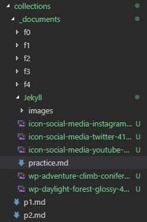

---
---

## 練習`kramdown`
Practice makes perfect.

### 基礎練習
1. 蘋果
1. 香蕉
1. 糖果
1. 鴨子
^
1. 自行車
1. 機車
1. 汽車
1. 飛機
1. 太空梭

- 這是中文，
  如果分行寫，
  可不可以不要多出空
  格呢？

- blockquote
>   第1層
>>  第2層
>>
>>  還是第2層
>
>   回到第1層

- code block
~~~ csharp
    /// <sumamry>
    /// Practice makes perfect.
    /// </sumamry>
    public class Practice
    {
        public int Yo { get; set; }

        public string Man { get; set; }
    }
~~~

### 檔案練習
- [pdf下載](pdfs/Pronunciation.pdf)

### 貼圖練習
- 來源
    - [Pexels](https://www.pexels.com/photo-license/)
    - [IconFinder](https://www.iconfinder.com/free_icons)

- 貼截圖

  

- 貼icon(不換行)
  {:width="32"}
  {:width="32"}
  {:width="32"}

- 貼icon(換行)

  {:width="32"}

  {:width="32"}
  {:width="32"}

- 貼桌布(不限寬)

  
  

- 貼桌布(限寬)

  {:width="200"}
  {:width="200"}

### 表格練習
這是一張kramdown的表
^
|---
| 預設對齊 | 置左 | 置中 | 置右
|-|:-|:-:|-:
| tbody1-好像不能打很多字 | 格子2-好像不能打很多字 | 格子3-好像不能打很多字 | 格子4-好像不能打很多字
| 我預設 | 我置左 | 我置中 | 我置右
|---
| tbody2
| 格子1 | 格子2 | | 格子4
|===
| tfoot | 表尾2 | 表尾3 | 表尾4

 
這是一張html的表
^
<table>
<thead>
<tr>
    <th>欄位1</th>
    <th>欄位2</th>
    <th>欄位3</th>
    <th>欄位4</th>
</tr>
</thead>
<tbody>
<tr>
    <td>蘋果</td>
    <td>水梨</td>
    <td>橘子</td>
    <td>芭樂</td>
</tr>
<tr>
    <td>
        如果
        蘋果
        真的太好吃，我可能會寫很多字
    </td>
    <td>
        如果
        水梨
        真的太好吃，我可能會寫很多字
    </td>
    <td>
        如果
        橘子
        真的太好吃，我可能會寫很多字
    </td>
    <td>
        如果
        芭樂
        真的太好吃，我可能會寫很多字
    </td>
</tr>
<tr>
    <td colspan="2">
        儲存格合併 1 + 2
    </td>
    <td colspan="2">
        儲存格合併 3 + 4
    </td>
</tr>
</tbody>
</table>

### 數學練習
- block
    - 沒數學 
        每月應付本息金額之平均攤還率 = ((1 + 月利率)^月數 * 月利率) / (((1 + 月利率) ^ 月數) - 1) 
        月利率 = 年利率 / 12 
        月數 = 貸款年期 * 12
    - 有數學
        $$
            \begin{align}
                \text{每月應付本息金額之平均攤還率} &=
                    \frac
                        {(1 + \text{月利率}) ^ \text{月數} \times \text{月利率}}
                        {(1 + \text{月利率}) ^ \text{月數} - 1}
                \\
                \text{月利率} &= \text{年利率} \div 12
                \\
                \text{月數} &= \text{貸款年期} \times 12
            \end{align}
        $$
    - 符號表示 
        $$
            \begin{align}
                \text{月利率} &= \text{年利率} \div 12 \\
                \text{月數} &= \text{貸款年期} \times 12 \\
                r &= \text{月利率} \\
                m &= \text{月數} \\
                ratio &= \text{每月應付本息金額之平均攤還率} \\
                ratio &= \frac
                    {(1 + r)^m \times r}
                    {(1 + r)^m - 1}
            \end{align}
        $$
- inline
    - 月利率 = $$ \tfrac{\text{年利率}}{12} $$，四捨五入至小數8位
    - 表述「相差k個標準差」，即在 $$ \bar{x} \pm kS $$ 的樣本範圍內考量

### 子標題2
我有很多字，我真的有很多字，我有很多字，我真的有很多字，我有很多字，我真的有很多字
我有很多字，我真的有很多字，我有很多字，我真的有很多字，我有很多字，我真的有很多字
我有很多字，我真的有很多字，我有很多字，我真的有很多字，我有很多字，我真的有很多字
我有很多字，我真的有很多字，我有很多字，我真的有很多字，我有很多字，我真的有很多字
我有很多字，我真的有很多字，我有很多字，我真的有很多字，我有很多字，我真的有很多字
我有很多字，我真的有很多字，我有很多字，我真的有很多字，我有很多字，我真的有很多字
我有很多字，我真的有很多字，我有很多字，我真的有很多字，我有很多字，我真的有很多字
我有很多字，我真的有很多字，我有很多字，我真的有很多字，我有很多字，我真的有很多字
我有很多字，我真的有很多字，我有很多字，我真的有很多字，我有很多字，我真的有很多字
我有很多字，我真的有很多字，我有很多字，我真的有很多字，我有很多字，我真的有很多字
我有很多字，我真的有很多字，我有很多字，我真的有很多字，我有很多字，我真的有很多字
我有很多字，我真的有很多字，我有很多字，我真的有很多字，我有很多字，我真的有很多字
我有很多字，我真的有很多字，我有很多字，我真的有很多字，我有很多字，我真的有很多字
我有很多字，我真的有很多字，我有很多字，我真的有很多字，我有很多字，我真的有很多字
我有很多字，我真的有很多字，我有很多字，我真的有很多字，我有很多字，我真的有很多字
我有很多字，我真的有很多字，我有很多字，我真的有很多字，我有很多字，我真的有很多字

### 子標題3
我有很多字，我真的有很多字，我有很多字，我真的有很多字，我有很多字，我真的有很多字
我有很多字，我真的有很多字，我有很多字，我真的有很多字，我有很多字，我真的有很多字
我有很多字，我真的有很多字，我有很多字，我真的有很多字，我有很多字，我真的有很多字
我有很多字，我真的有很多字，我有很多字，我真的有很多字，我有很多字，我真的有很多字
我有很多字，我真的有很多字，我有很多字，我真的有很多字，我有很多字，我真的有很多字
我有很多字，我真的有很多字，我有很多字，我真的有很多字，我有很多字，我真的有很多字
我有很多字，我真的有很多字，我有很多字，我真的有很多字，我有很多字，我真的有很多字
我有很多字，我真的有很多字，我有很多字，我真的有很多字，我有很多字，我真的有很多字
我有很多字，我真的有很多字，我有很多字，我真的有很多字，我有很多字，我真的有很多字
我有很多字，我真的有很多字，我有很多字，我真的有很多字，我有很多字，我真的有很多字
我有很多字，我真的有很多字，我有很多字，我真的有很多字，我有很多字，我真的有很多字
我有很多字，我真的有很多字，我有很多字，我真的有很多字，我有很多字，我真的有很多字
我有很多字，我真的有很多字，我有很多字，我真的有很多字，我有很多字，我真的有很多字
我有很多字，我真的有很多字，我有很多字，我真的有很多字，我有很多字，我真的有很多字
我有很多字，我真的有很多字，我有很多字，我真的有很多字，我有很多字，我真的有很多字
我有很多字，我真的有很多字，我有很多字，我真的有很多字，我有很多字，我真的有很多字

### 子標題4
我有很多字，我真的有很多字，我有很多字，我真的有很多字，我有很多字，我真的有很多字
我有很多字，我真的有很多字，我有很多字，我真的有很多字，我有很多字，我真的有很多字
我有很多字，我真的有很多字，我有很多字，我真的有很多字，我有很多字，我真的有很多字
我有很多字，我真的有很多字，我有很多字，我真的有很多字，我有很多字，我真的有很多字
我有很多字，我真的有很多字，我有很多字，我真的有很多字，我有很多字，我真的有很多字
我有很多字，我真的有很多字，我有很多字，我真的有很多字，我有很多字，我真的有很多字
我有很多字，我真的有很多字，我有很多字，我真的有很多字，我有很多字，我真的有很多字
我有很多字，我真的有很多字，我有很多字，我真的有很多字，我有很多字，我真的有很多字
我有很多字，我真的有很多字，我有很多字，我真的有很多字，我有很多字，我真的有很多字
我有很多字，我真的有很多字，我有很多字，我真的有很多字，我有很多字，我真的有很多字
我有很多字，我真的有很多字，我有很多字，我真的有很多字，我有很多字，我真的有很多字
我有很多字，我真的有很多字，我有很多字，我真的有很多字，我有很多字，我真的有很多字
我有很多字，我真的有很多字，我有很多字，我真的有很多字，我有很多字，我真的有很多字
我有很多字，我真的有很多字，我有很多字，我真的有很多字，我有很多字，我真的有很多字
我有很多字，我真的有很多字，我有很多字，我真的有很多字，我有很多字，我真的有很多字
我有很多字，我真的有很多字，我有很多字，我真的有很多字，我有很多字，我真的有很多字

## 第二大主題

### 子標題1
#### 小標1
#### 小標2

### 子標題2
#### 小標1
#### 小標2

### 子標題3
#### 小標1
#### 小標2

### 子標題4
#### 小標1
#### 小標2
