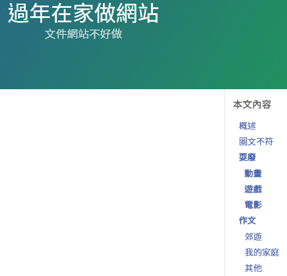

---
---

# Overview
Practice makes perfect.

# 圖文不符

# 耍廢

## 動畫

### Re:Zero
`string: 50`
`M`

- 雷姆<3
- 雷姆<3

### 雷姆
`string: 50`
`M`

- 雷姆<3
- 雷姆<3

### 拉姆
`string: 50`
`M`

### 暗殺教室
`string: 50`
`M`

-   單行本第6卷與同刊作品《影子籃球員》第24卷單行本初版發行數字一同突破100萬部，
    是自創刊以來46年來的首次佳績。
-   2014年33號公布動畫版的播放時間為2015年1月每週五的深夜時段。
    於動畫14集後放出第二季製作的消息。動畫第二季在2016年開始播出。

## 遊戲

### ICEY
`number: +3`
`M`

### Slay the Spire
`number: +3`
`M`

### Kingdom Rush Origins
`number: +3`
`M`

### Age of Empires
`number: +3`
`M`

## 電影

### 奪魂鋸1
`date`
`M`

### 奪魂鋸2
`date`
`M`

### 奪魂鋸3
`date`
`M`

### 奪魂鋸4
`date: CY`
`M`

### 奪魂鋸5
`date: CY`
`M`

### 奪魂鋸6
`date: 0CY`
`M`

### 奪魂鋸7
`date: 0CY`
`M`

# 作文

## 郊遊
打字打字打字{區塊區塊區塊}[欄位欄位欄位]打字(打字)打字，
打字打字打字{區塊區塊區塊}[欄位欄位欄位]打字(打字)打字，
打字打字打字{區塊區塊區塊}[欄位欄位欄位]打字(打字)打字，
打字打字打字{區塊區塊區塊}[欄位欄位欄位]打字(打字)打字，
打字打字打字{區塊區塊區塊}[欄位欄位欄位]打字(打字)打字，
打字打字打字{區塊區塊區塊}[欄位欄位欄位]打字(打字)打字
1.  如果打字打字打字{區塊區塊區塊}[欄位欄位欄位]打字(打字)打字
1.  如果打字打字打字{區塊區塊區塊}[欄位欄位欄位]打字(打字)打字
    1.  如果打字打字打字{區塊區塊區塊}[欄位欄位欄位]打字(打字)打字，
        我還想打更多，但不要是English。
    1.  如果打字打字打字{區塊區塊區塊}[欄位欄位欄位]打字(打字)打字，
        sometimes也會想烙一下English，真的。
1.  如果有文字樣板的話可能是這樣子的吧：
    `於{YYYY}年{MM}月{DD}日上傳﹝雲端﹞後，再Line給【朋友】甲；
    於{YYYY}年{MM}月{DD}日上傳﹝雲端﹞後，再Line給【隊友】乙；
    於{YYYY}年{MM}月{DD}日上傳﹝雲端﹞後，再Line給【隊友】丙。`
    送出樣板後再吞一把劍，多寫幾段流水帳，也許可以當散文。
    - 時間應該是膝蓋中了一箭的那一天
    - 不要重複寫一堆有的沒的

## 我的家庭
打字打字打字{區塊區塊區塊}[欄位欄位欄位]打字(打字)打字，
打字打字打字{區塊區塊區塊}[欄位欄位欄位]打字(打字)打字，
打字打字打字{區塊區塊區塊}[欄位欄位欄位]打字(打字)打字，
打字打字打字{區塊區塊區塊}[欄位欄位欄位]打字(打字)打字，
打字打字打字{區塊區塊區塊}[欄位欄位欄位]打字(打字)打字，
打字打字打字{區塊區塊區塊}[欄位欄位欄位]打字(打字)打字
1.  如果打字打字打字{區塊區塊區塊}[欄位欄位欄位]打字(打字)打字
1.  如果打字打字打字{區塊區塊區塊}[欄位欄位欄位]打字(打字)打字
    1. 如果打字打字打字{區塊區塊區塊}[欄位欄位欄位]打字(打字)打字
    1. 如果打字打字打字{區塊區塊區塊}[欄位欄位欄位]打字(打字)打字

## 其他
1.  打字打字打字{區塊區塊區塊}[欄位欄位欄位]打字(打字)打字，
    打字打字打字{區塊區塊區塊}[欄位欄位欄位]打字(打字)打字，
    打字打字打字{區塊區塊區塊}[欄位欄位欄位]打字(打字)打字，
    打字打字打字{區塊區塊區塊}[欄位欄位欄位]打字(打字)打字，
    打字打字打字{區塊區塊區塊}[欄位欄位欄位]打字(打字)打字，
    打字打字打字{區塊區塊區塊}[欄位欄位欄位]打字(打字)打字
    1.  如果打字打字打字{區塊區塊區塊}[欄位欄位欄位]打字(打字)打字
    1.  如果打字打字打字{區塊區塊區塊}[欄位欄位欄位]打字(打字)打字
        1. 如果打字打字打字{區塊區塊區塊}[欄位欄位欄位]打字(打字)打字
        1. 如果打字打字打字{區塊區塊區塊}[欄位欄位欄位]打字(打字)打字
1.  打字打字打字{區塊區塊區塊}[欄位欄位欄位]打字(打字)打字，
    打字打字打字{區塊區塊區塊}[欄位欄位欄位]打字(打字)打字，
    打字打字打字{區塊區塊區塊}[欄位欄位欄位]打字(打字)打字，
    打字打字打字{區塊區塊區塊}[欄位欄位欄位]打字(打字)打字，
    打字打字打字{區塊區塊區塊}[欄位欄位欄位]打字(打字)打字，
    打字打字打字{區塊區塊區塊}[欄位欄位欄位]打字(打字)打字
    1.  如果打字打字打字{區塊區塊區塊}[欄位欄位欄位]打字(打字)打字
    1.  如果打字打字打字{區塊區塊區塊}[欄位欄位欄位]打字(打字)打字
        1. 如果打字打字打字{區塊區塊區塊}[欄位欄位欄位]打字(打字)打字
        1. 如果打字打字打字{區塊區塊區塊}[欄位欄位欄位]打字(打字)打字

